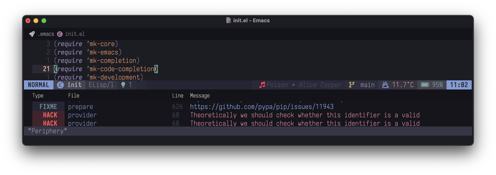

<div align="center">
  

  # Periphery

  **Generic Parser Framework for Emacs**

  A flexible, configurable parsing framework for displaying compilation errors, test results, search matches, and linter output in a unified interface within Emacs.

  ---

  ❤️ [Please sponsor me if you like this package](https://github.com/sponsors/konrad1977)

  ---
</div>

## Features

- **Modular Parser System**: Register and configure parsers for different output types
- **Unified Display**: All results shown in a consistent tabulated list format
- **Extensible**: Easy to add new parsers for different tools
- **Performance Optimized**: Async parsing support for large outputs
- **Rich Syntax Highlighting**: Customizable faces for different severity levels and syntax elements

## Screenshots

### Compiler Errors and Warnings


### TODO/FIXME Tracking


## Installation

### Using use-package (Emacs 30+)

Emacs 30 includes built-in support for installing packages directly from Git repositories using the `:vc` keyword:

```elisp
(use-package periphery
  :vc (:url "https://github.com/konrad1977/periphery"
       :rev :newest)
  :custom
  ;; Adjust background darkness (0-100, higher = darker background)
  (periphery-background-darkness 85)

  ;; Use theme colors instead of default Catppuccin colors
  (periphery-use-theme-colors t)

  ;; Trim message prefixes for cleaner display
  (periphery-trim-message-prefix t)

  ;; Enable debug mode if needed
  (periphery-debug nil)

  :config
  ;; Optional: Clear color cache when switching themes
  (add-hook 'after-load-theme-hook #'periphery--clear-color-cache))
```

### Manual Installation

Load periphery in your Emacs configuration:

```elisp
(add-to-list 'load-path "/path/to/periphery")
(require 'periphery)
```

## Configuration

### Color Customization

Periphery now uses a smart color system that automatically generates background colors from foreground colors. You can customize the appearance in several ways:

#### Adjust Background Darkness

Control how much darker the backgrounds should be compared to the text color:

```elisp
;; Default: 85% darker (darker backgrounds)
(setq periphery-background-darkness 85)

;; Lighter backgrounds (70% darker)
(setq periphery-background-darkness 70)

;; Much darker backgrounds (95% darker)
(setq periphery-background-darkness 95)

;; After changing, clear the color cache
(periphery--clear-color-cache)
```

#### Use Theme Colors

Enable automatic color detection from your current theme:

```elisp
;; Use theme's error/warning/info colors (default: t)
(setq periphery-use-theme-colors t)

;; Use default Catppuccin colors regardless of theme
(setq periphery-use-theme-colors nil)
```

#### Customize Base Face Colors

You can override the base face colors used by periphery:

```elisp
;; Customize individual face foreground colors
(custom-set-faces
 '(periphery-error-face ((t (:foreground "#ff5555"))))
 '(periphery-warning-face ((t (:foreground "#ffb86c"))))
 '(periphery-todo-face ((t (:foreground "#8be9fd"))))
 '(periphery-fix-face ((t (:foreground "#bd93f9"))))
 '(periphery-note-face ((t (:foreground "#50fa7b"))))
 '(periphery-hack-face ((t (:foreground "#ff79c6"))))
 '(periphery-performance-face ((t (:foreground "#f1fa8c"))))
 '(periphery-mark-face ((t (:foreground "#6272a4")))))

;; Clear cache after face changes
(periphery--clear-color-cache)
```

### Complete use-package Configuration Example

Here's a comprehensive example showing all customization options:

```elisp
(use-package periphery
  :vc (:url "https://github.com/konrad1977/periphery"
       :rev :newest)
  :custom
  ;; Color system
  (periphery-background-darkness 85 "Background darkness percentage")
  (periphery-use-theme-colors t "Use theme colors automatically")

  ;; Display options
  (periphery-trim-message-prefix t "Remove redundant prefixes from messages")
  (periphery-debug nil "Enable debug messages")

  :custom-face
  ;; Customize face colors (backgrounds are auto-generated)
  (periphery-error-face ((t (:foreground "#f38ba8"))))
  (periphery-warning-face ((t (:foreground "#f9e2af"))))
  (periphery-todo-face ((t (:foreground "#74c7ec"))))

  :config
  ;; Automatically clear color cache when theme changes
  (add-hook 'after-load-theme-hook #'periphery--clear-color-cache)

  ;; Add custom syntax highlighting patterns
  (periphery-add-highlight-pattern
   'my-custom-element
   "my-regex-pattern"
   'my-custom-face)

  ;; Optional: Register custom parsers
  (periphery-register-parser
   'my-tool
   :name "My Custom Tool"
   :regex "^\\(.*\\):\\([0-9]+\\):\\([0-9]+\\): \\(.*\\): \\(.*\\)$"
   :type :linter
   :priority 50
   :parse-fn #'my-custom-parse-function
   :face-fn #'periphery-parser--severity-face))
```

## Public API

### Parsing Functions

#### `periphery-run-parser`
Parse input with automatic parser selection.

```elisp
;; Parse compiler output
(periphery-run-parser compiler-output :compiler)

;; Parse search results with query highlighting
(periphery-run-parser search-output :search "TODO")

;; Parse linter output
(periphery-run-parser ktlint-output :ktlint)

;; Parse test results
(periphery-run-parser test-output :test)
```

#### `periphery-core-parse`
Lower-level parsing function with more control.

```elisp
(periphery-core-parse
  :input some-output
  :type :compiler  ; :compiler, :search, :linter, or :test
  :callback (lambda (results)
              (message "Found %d issues" (length results))))
```

#### `periphery-core-run-async`
Parse input asynchronously (useful for large outputs).

```elisp
(periphery-core-run-async
  compiler-output
  :compiler
  (lambda (results)
    (message "Async parse complete: %d issues" (length results))))
```

### Parser Management

#### `periphery-register-parser`
Register a new parser for your tool.

```elisp
(periphery-register-parser
  'my-parser-id
  :name "Display Name"
  :regex "regex-pattern"
  :type :linter  ; :compiler, :search, :linter, or :test
  :priority 50   ; Higher = processed first (default: 50)
  :parse-fn #'my-parse-function
  :face-fn #'my-face-function)
```

#### `periphery-get-parser`
Get a parser configuration by ID.

```elisp
(periphery-get-parser 'compiler)
```

#### `periphery-get-parsers-by-type`
Get all enabled parsers of a specific type.

```elisp
(periphery-get-parsers-by-type :linter)
```

#### `periphery-enable-parser` / `periphery-disable-parser`
Interactively enable or disable parsers.

```elisp
M-x periphery-enable-parser
M-x periphery-disable-parser
```

### Buffer Management

#### `periphery:toggle-buffer`
Toggle the visibility of the Periphery results buffer.

```elisp
M-x periphery:toggle-buffer
```

#### `periphery-kill-buffer`
Close and kill the Periphery buffer.

```elisp
M-x periphery-kill-buffer
```

### Syntax Highlighting

#### `periphery-add-highlight-pattern`
Add custom syntax highlighting patterns for error messages.

```elisp
(periphery-add-highlight-pattern
  'backticks
  "`\\([^`]+\\)`"
  'periphery-identifier-face)
```

#### `periphery-remove-highlight-pattern`
Remove a syntax highlighting pattern.

```elisp
M-x periphery-remove-highlight-pattern
```

#### `periphery-list-highlight-patterns`
List all configured highlight patterns.

```elisp
M-x periphery-list-highlight-patterns
```

### Configuration Variables

- `periphery-debug` - Enable debug output (default: `nil`)
- `periphery-trim-message-prefix` - Trim message prefixes up to first colon (default: `nil`)

## Creating a New Parser

Follow these steps to create a parser for a new tool:

### 1. Write a Parse Function

Your parse function receives a line of text and should return an entry or `nil`:

```elisp
(defun my-tool-parser (line)
  "Parse output from my-tool."
  (when (string-match "\\([^:]+\\):\\([0-9]+\\): \\(\\w+\\) - \\(.*\\)" line)
    (let ((file (match-string 1 line))
          (line-num (match-string 2 line))
          (severity (match-string 3 line))
          (message (match-string 4 line)))
      (periphery-core-build-entry
        :path (format "%s:%s" file line-num)
        :file file
        :line line-num
        :severity severity
        :message message
        :face-fn #'my-tool-face-function))))
```

### 2. Create a Face Function (Optional)

Map severity levels to display faces with automatically generated backgrounds:

```elisp
(defun my-tool-face-function (severity)
  "Return face with background for SEVERITY level."
  (let* ((base-face
          (pcase (downcase severity)
            ("error" 'periphery-error-face)
            ("warning" 'periphery-warning-face)
            ("info" 'periphery-info-face)
            (_ 'periphery-note-face))))
    ;; Generate face with automatic background
    (periphery--get-face-with-background base-face)))
```

Or use the built-in helper function:

```elisp
(defun my-tool-face-function (severity)
  "Return face with background for SEVERITY level."
  (periphery-parser--severity-face severity))
```

### 3. Register Your Parser

Register the parser to make it active:

```elisp
(periphery-register-parser
  'my-tool
  :name "My Tool"
  :regex "\\([^:]+\\):\\([0-9]+\\): \\(\\w+\\) - \\(.*\\)"
  :type :linter
  :priority 60
  :parse-fn #'my-tool-parser
  :face-fn #'my-tool-face-function)
```

### 4. Use Your Parser

```elisp
;; Parse my-tool output
(periphery-run-parser my-tool-output :linter)

;; Or specifically use your parser
(periphery-core-parse :input my-tool-output :parsers '(my-tool))
```

### Complete Example: ESLint Parser

Here's a complete example showing all steps:

```elisp
;; Step 1: Parse function
(defun my-eslint-parser (line)
  "Parse ESLint output from LINE."
  (when (string-match "\\([^:]+\\):\\([0-9]+\\):\\([0-9]+\\): \\(\\w+\\) - \\(.*\\)" line)
    (let ((file (match-string 1 line))
          (line-num (match-string 2 line))
          (col (match-string 3 line))
          (severity (match-string 4 line))
          (message (match-string 5 line)))
      (periphery-core-build-entry
        :path (format "%s:%s:%s" file line-num col)
        :file file
        :line line-num
        :column col
        :severity severity
        :message message
        :face-fn #'my-eslint-face))))

;; Step 2: Face function (generates backgrounds automatically)
(defun my-eslint-face (severity)
  "Return face with background for ESLint SEVERITY."
  (let* ((base-face
          (pcase (downcase severity)
            ("error" 'periphery-error-face)
            ("warning" 'periphery-warning-face)
            (_ 'periphery-info-face))))
    (periphery--get-face-with-background base-face)))

;; Step 3: Register parser
(periphery-register-parser
  'eslint
  :name "ESLint"
  :regex "\\([^:]+\\):\\([0-9]+\\):\\([0-9]+\\): \\(\\w+\\) - \\(.*\\)"
  :type :linter
  :priority 70
  :parse-fn #'my-eslint-parser
  :face-fn #'my-eslint-face)

;; Step 4: Use it
(periphery-run-parser eslint-output :linter)
```

## Built-in Parsers

Periphery includes parsers for:

- **Compiler**: Xcode/Swift compiler errors and warnings
- **XCTest**: Xcode test results
- **Search**: Generic search results with TODO/FIXME detection
- **Ktlint**: Kotlin linter output
- **SwiftLint**: Swift linter output

## Available Faces

Periphery uses a smart color system where backgrounds are automatically generated from foreground colors. You only need to customize the base faces (foreground colors), and backgrounds will be created automatically based on `periphery-background-darkness`.

### Severity Faces (Base)
- `periphery-error-face` - Error messages and failures
- `periphery-warning-face` - Warnings and potential issues
- `periphery-info-face` - Informational messages
- `periphery-note-face` - Notes and hints

### Special Keyword Faces (Base)
- `periphery-todo-face` - TODO items
- `periphery-fix-face` - FIX/FIXME items
- `periphery-hack-face` - HACK items
- `periphery-performance-face` - PERF items
- `periphery-mark-face` - MARK items

### UI Element Faces
- `periphery-filename-face` - File names in results (inherits from `link`)
- `periphery-linenumber-face` - Line numbers (inherits from `line-number`)
- `periphery-message-face` - Message text
- `periphery-first-sentence-face` - First sentence highlighting

### Generating Faces with Backgrounds

To get a face with an automatically generated background, use:

```elisp
(periphery--get-face-with-background 'periphery-error-face)
;; Returns: (:foreground "#f38ba8" :background "#260026" :bold t :distant-foreground "#f38ba8")
```

Built-in helper functions that generate faces with backgrounds:
- `periphery-parser--severity-face` - For ERROR/WARNING/INFO/NOTE keywords
- `periphery-parser--todo-face` - For TODO/FIX/HACK/PERF/MARK keywords
- `periphery-parser--match-face` - For search matches

## License
MIT
